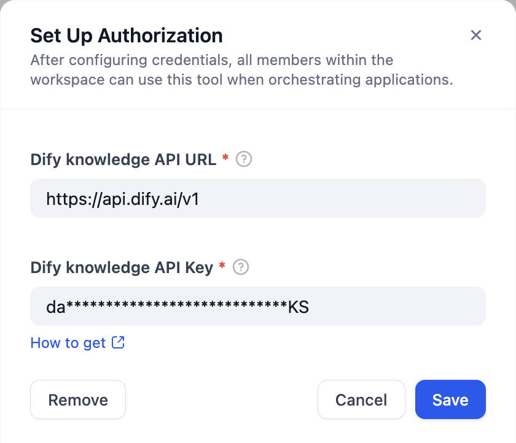
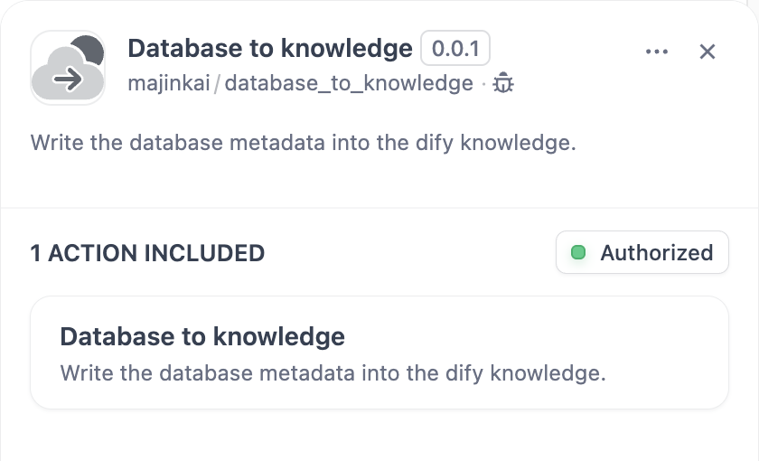
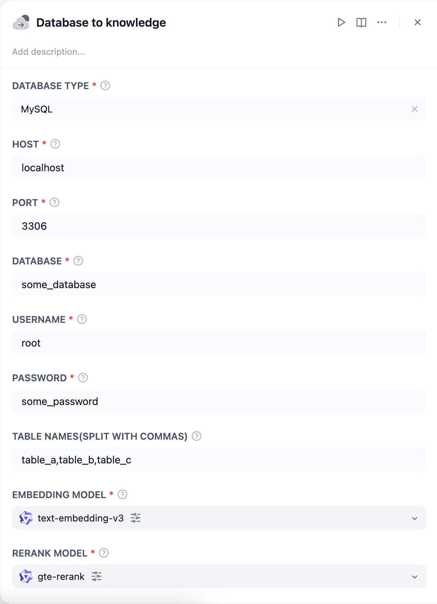

## Database to knowledge

**Author:** majinkai
**Version:** 0.0.2
**Type:** tool

### How to use

1. Use the API of the knowledge base for authentication(This tool use [Get Knowledge Base List](https://docs.dify.ai/guides/knowledge-base/knowledge-and-documents-maintenance/maintain-dataset-via-api#get-knowledge-base-list) API with page 1 and limit 1 to verify `API Key`)

2. Set database configuration information

3. Run it to test, it will create a knowledge named `some_database` and `table a,b,c` three documents

### Verified databases
* MySQL (✅)
* Oracle (✅)
* Microsoft SQL Server (✅)
* PostgreSQL (✅)
* Apach Doris (✅)
